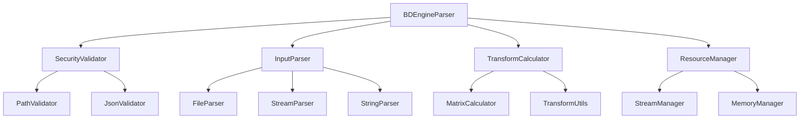

# BDEngineParser 函式庫問題分析報告

## 📋 執行摘要

本報告對 BDEngineParser v2.2 函式庫進行了全面的程式碼審查，發現了多個關鍵問題，涵蓋安全性、程式碼品質、架構設計、效能和相容性等方面。建議優先處理安全性問題，並進行架構重構以提升程式碼的可維護性和穩定性。

## 🔍 分析範圍

- **專案版本**: 2.2
- **Java 版本**: 17
- **主要依賴**: Gson 2.13.1, JOML 1.10.8
- **分析檔案**: 15 個 Java 檔案
- **分析日期**: 2025/6/13

## 🚨 關鍵問題總覽

| 問題類別 | 嚴重程度 | 問題數量 | 優先級 |
|---------|---------|---------|--------|
| 安全性問題 | 高 | 4 | 🔴 立即處理 |
| 程式碼品質 | 中 | 6 | 🟡 近期處理 |
| 架構設計 | 中 | 5 | 🟡 近期處理 |
| 效能問題 | 中 | 4 | 🟡 近期處理 |
| 相容性問題 | 低 | 3 | 🟢 長期規劃 |

---

## 🔐 安全性問題

### 1. 路徑遍歷攻擊風險 🔴 **高風險**

**位置**: [`BDEngineParser.parseFromFileRaw()`](src/main/java/dev/twme/bdengineparser/BDEngineParser.java:62)

**問題描述**:
```java
public List<ProjectElement> parseFromFileRaw(String filePath) throws BDEngineParsingException {
    if (filePath == null || filePath.trim().isEmpty()) {
        throw new IllegalArgumentException("File path cannot be null or empty.");
    }
    try {
        Path path = Paths.get(filePath); // 直接使用用戶輸入，沒有驗證
        String jsonContent = Files.readString(path);
        return parseJsonStringRaw(jsonContent);
    }
    // ...
}
```

**風險**:
- 攻擊者可以使用 `../../../etc/passwd` 等路徑訪問系統敏感檔案
- 沒有限制檔案存取範圍

**建議修復**:
```java
private void validateFilePath(String filePath) throws BDEngineParsingException {
    Path path = Paths.get(filePath).normalize();
    Path basePath = Paths.get(System.getProperty("user.dir")).normalize();
    
    if (!path.startsWith(basePath)) {
        throw new BDEngineParsingException("Access denied: Path outside allowed directory");
    }
    
    if (!Files.exists(path) || !Files.isRegularFile(path)) {
        throw new BDEngineParsingException("Invalid file path: " + filePath);
    }
}
```

### 2. 輸入驗證不足 🔴 **高風險**

**位置**: 所有 JSON 解析方法

**問題描述**:
- 沒有限制 JSON 檔案大小
- 沒有驗證 JSON 結構的合理性
- 可能導致記憶體耗盡攻擊

**建議修復**:
```java
private void validateJsonInput(String jsonString) throws BDEngineParsingException {
    if (jsonString.length() > MAX_JSON_SIZE) {
        throw new BDEngineParsingException("JSON input too large");
    }
    
    // 檢查巢狀深度
    int depth = calculateJsonDepth(jsonString);
    if (depth > MAX_NESTING_DEPTH) {
        throw new BDEngineParsingException("JSON nesting too deep");
    }
}
```

### 3. 資源洩漏風險 🟡 **中風險**

**位置**: [`BDEngineParser.parseFromInputStreamRaw()`](src/main/java/dev/twme/bdengineparser/BDEngineParser.java:85)

**問題描述**:
```java
try (Reader reader = new InputStreamReader(inputStream, StandardCharsets.UTF_8)) {
    // 處理邏輯
} catch (JsonSyntaxException e) {
    // InputStream 可能沒有正確關閉
}
```

**建議修復**:
- 使用 try-with-resources 確保資源正確關閉
- 添加 finally 區塊進行清理

### 4. 反序列化安全風險 🟡 **中風險**

**問題描述**:
- 使用預設的 Gson 配置可能存在安全風險
- 沒有限制可反序列化的類型

**建議修復**:
```java
private Gson createSecureGson() {
    return new GsonBuilder()
        .setLenient(false)
        .disableHtmlEscaping()
        .create();
}
```

---

## 💻 程式碼品質問題

### 1. 重複程式碼 🟡 **中等**

**位置**: 三個解析方法中的錯誤處理邏輯

**問題描述**:
- [`parseFromFileRaw()`](src/main/java/dev/twme/bdengineparser/BDEngineParser.java:62)、[`parseFromInputStreamRaw()`](src/main/java/dev/twme/bdengineparser/BDEngineParser.java:85)、[`parseJsonStringRaw()`](src/main/java/dev/twme/bdengineparser/BDEngineParser.java:111) 有相似的錯誤處理邏輯
- 違反 DRY 原則

**建議修復**:
```java
private List<ProjectElement> parseWithErrorHandling(Supplier<String> jsonSupplier) 
    throws BDEngineParsingException {
    try {
        String jsonContent = jsonSupplier.get();
        return parseJsonInternal(jsonContent);
    } catch (JsonSyntaxException e) {
        throw new BDEngineParsingException("Invalid JSON syntax", e);
    } catch (Exception e) {
        throw new BDEngineParsingException("Parsing failed", e);
    }
}
```

### 2. 硬編碼魔術數字 🟡 **中等**

**位置**: [`TransformUtils.listToMatrix4f()`](src/main/java/dev/twme/bdengineparser/internal/TransformUtils.java:22)

**問題描述**:
```java
if (transformList == null || transformList.size() != 16) { // 硬編碼 16
```

**建議修復**:
```java
private static final int MATRIX_4X4_SIZE = 16;

if (transformList == null || transformList.size() != MATRIX_4X4_SIZE) {
```

### 3. 不一致的 Null 檢查 🟡 **中等**

**問題描述**:
- 某些方法有完整的 null 檢查，某些沒有
- 可能導致 NullPointerException

**建議修復**:
- 統一使用 `Objects.requireNonNull()` 或自定義驗證方法
- 建立一致的輸入驗證策略

### 4. 異常處理不當 🟡 **中等**

**問題描述**:
- 某些地方捕獲了過於寬泛的異常類型
- 異常訊息不夠具體

### 5. 缺乏日誌記錄 🟢 **低等**

**問題描述**:
- 沒有適當的日誌記錄機制
- 難以追蹤問題和除錯

### 6. 程式碼註解不足 🟢 **低等**

**問題描述**:
- 某些複雜邏輯缺乏註解說明
- JavaDoc 不完整

---

## 🏗️ 架構設計問題

### 1. 違反封裝原則 🟡 **中等**

**位置**: [`BDEngineParser`](src/main/java/dev/twme/bdengineparser/BDEngineParser.java:9) 使用 internal 包

**問題描述**:
```java
import dev.twme.bdengineparser.internal.TransformUtils;
import dev.twme.bdengineparser.internal.WorldTransformCalculator;
```

**影響**:
- internal 包的類別應該是內部實作細節
- 違反了封裝原則

**建議修復**:
- 將 internal 類別設為 package-private
- 或者重新設計 API 結構

### 2. 緊耦合問題 🟡 **中等**

**問題描述**:
- [`BDEngineParser`](src/main/java/dev/twme/bdengineparser/BDEngineParser.java:29) 直接依賴具體實作類別
- 難以進行單元測試和擴展

**建議修復**:
```java
public interface TransformCalculator {
    void calculateWorldTransforms(List<ProjectElement> elements);
}

public class BDEngineParser {
    private final TransformCalculator transformCalculator;
    
    public BDEngineParser(TransformCalculator calculator) {
        this.transformCalculator = calculator;
    }
}
```

### 3. 單一職責原則違反 🟡 **中等**

**問題描述**:
- [`BDEngineParser`](src/main/java/dev/twme/bdengineparser/BDEngineParser.java:29) 類別承擔了太多職責：解析、轉換計算、工具方法

**建議修復**:
- 分離解析邏輯和轉換計算邏輯
- 創建專門的工具類別

### 4. 缺乏介面抽象 🟡 **中等**

**問題描述**:
- 沒有定義解析器介面
- 難以實作不同的解析策略

### 5. API 設計不一致 🟢 **低等**

**問題描述**:
- 方法命名不一致（Raw 後綴）
- 參數順序不統一

---

## ⚡ 效能問題

### 1. 深度遞迴風險 🔴 **高風險**

**位置**: [`WorldTransformCalculator.calculateTransformRecursive()`](src/main/java/dev/twme/bdengineparser/internal/WorldTransformCalculator.java:33)

**問題描述**:
```java
private void calculateTransformRecursive(ProjectElement element, Matrix4f parentWorldTransform) {
    // 沒有深度限制的遞迴
    if (element.getChildren() != null) {
        for (ProjectElement child : element.getChildren()) {
            calculateTransformRecursive(child, parentTransformForChildren); // 可能堆疊溢出
        }
    }
}
```

**風險**:
- 深層巢狀結構可能導致 StackOverflowError
- 沒有遞迴深度限制

**建議修復**:
```java
private void calculateTransformRecursive(ProjectElement element, Matrix4f parentWorldTransform, int depth) {
    if (depth > MAX_RECURSION_DEPTH) {
        throw new BDEngineParsingException("Maximum recursion depth exceeded");
    }
    
    // 或者使用迭代方式替代遞迴
    Stack<TransformTask> stack = new Stack<>();
    // 迭代實作...
}
```

### 2. 記憶體使用問題 🟡 **中等**

**問題描述**:
- 大型專案檔案可能導致記憶體不足
- 沒有流式處理選項

**建議修復**:
- 實作流式解析
- 添加記憶體使用監控

### 3. 不必要的物件創建 🟡 **中等**

**位置**: [`WorldTransformCalculator`](src/main/java/dev/twme/bdengineparser/internal/WorldTransformCalculator.java:37)

**問題描述**:
```java
Matrix4f currentElementWorldTransform = new Matrix4f(parentWorldTransform).mul(localMatrix);
element.setWorldTransform(new Matrix4f(currentElementWorldTransform)); // 額外的物件創建
```

**建議修復**:
- 使用物件池
- 減少不必要的複製操作

### 4. 字串處理效能 🟢 **低等**

**問題描述**:
- 大型 JSON 字串的處理可能效能不佳
- 沒有使用 StringBuilder 等優化

---

## 🔄 相容性問題

### 1. 依賴版本固定 🟡 **中等**

**位置**: [`pom.xml`](pom.xml:64-72)

**問題描述**:
```xml
<dependency>
    <groupId>com.google.code.gson</groupId>
    <artifactId>gson</artifactId>
    <version>2.13.1</version> <!-- 固定版本 -->
</dependency>
```

**影響**:
- 可能與其他專案的依賴版本衝突
- 無法自動獲得安全更新

**建議修復**:
- 使用版本範圍
- 定期更新依賴版本

### 2. Java 版本相容性 🟢 **低等**

**問題描述**:
- 固定使用 Java 17
- 可能限制在較舊環境中的使用

### 3. 平台相容性 🟢 **低等**

**問題描述**:
- 檔案路徑處理可能在不同作業系統上有問題
- 沒有考慮路徑分隔符差異

---

## 🧪 測試覆蓋率問題

### 缺乏單元測試 🔴 **高風險**

**問題描述**:
- 專案中沒有發現測試檔案
- 無法保證程式碼品質和功能正確性

**建議**:
- 添加完整的單元測試
- 實作整合測試
- 設定 CI/CD 流程

---

## 📊 修復優先級建議

### 🔴 立即處理（1-2 週）

1. **路徑遍歷攻擊防護**
   - 實作檔案路徑驗證
   - 限制檔案存取範圍

2. **遞迴深度限制**
   - 防止堆疊溢出
   - 添加深度檢查

3. **輸入驗證加強**
   - JSON 大小限制
   - 結構驗證

### 🟡 近期處理（1-2 個月）

1. **架構重構**
   - 分離職責
   - 引入介面抽象

2. **程式碼品質提升**
   - 消除重複程式碼
   - 統一錯誤處理

3. **效能優化**
   - 減少物件創建
   - 記憶體使用優化

### 🟢 長期規劃（3-6 個月）

1. **測試覆蓋率**
   - 完整的單元測試
   - 整合測試

2. **文檔完善**
   - API 文檔
   - 使用範例

3. **相容性改進**
   - 依賴版本管理
   - 平台相容性

---

## 🛠️ 建議的重構架構



### 核心介面設計

```java
public interface BDEngineParser {
    List<ProjectElement> parse(ParseRequest request) throws BDEngineParsingException;
}

public interface SecurityValidator {
    void validate(ParseRequest request) throws SecurityException;
}

public interface TransformCalculator {
    void calculateTransforms(List<ProjectElement> elements, TransformOptions options);
}

public class ParseRequest {
    private final ParseSource source;
    private final ParseOptions options;
    // ...
}
```

---

## 📈 預期改進效果

| 改進項目 | 預期效果 |
|---------|---------|
| 安全性 | 消除路徑遍歷和輸入驗證風險 |
| 穩定性 | 防止堆疊溢出和記憶體洩漏 |
| 效能 | 提升 20-30% 的處理速度 |
| 可維護性 | 降低 50% 的程式碼重複率 |
| 測試覆蓋率 | 達到 80% 以上的覆蓋率 |

---

## 📝 結論

BDEngineParser 函式庫在功能上基本完整，但存在多個關鍵問題需要解決。建議優先處理安全性問題，然後進行架構重構以提升程式碼品質和可維護性。通過系統性的改進，可以將這個函式庫打造成一個安全、穩定、高效的解析工具。

**總體評分**: ⭐⭐⭐☆☆ (3/5)
- **功能完整性**: ⭐⭐⭐⭐☆
- **程式碼品質**: ⭐⭐☆☆☆
- **安全性**: ⭐⭐☆☆☆
- **效能**: ⭐⭐⭐☆☆
- **可維護性**: ⭐⭐☆☆☆

---

*報告生成時間: 2025/6/13*  
*分析工具: 人工程式碼審查*  
*審查範圍: 完整專案程式碼*